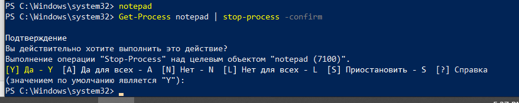
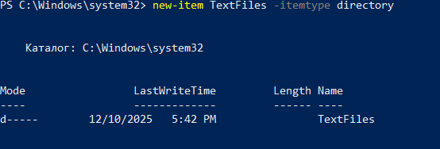
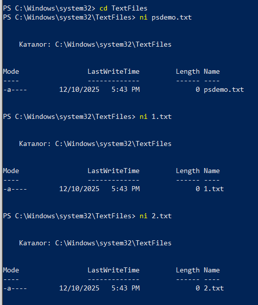
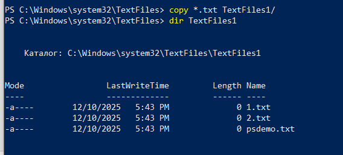
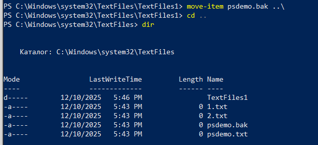
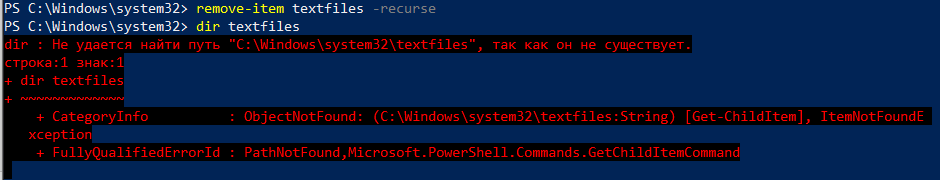

# Изучение основных возможностей WindowsPowerShell.        

## 📌 Цель работы 
Научиться использованию возможностей WindowsPowerShell для выполнения задач администрирования в ОС Windows.     

## ✅ Задание и отчет выполнения
1. Исполните из командной строки ```Help Get-Command```      
    

2. Выполните команду ```Get-Command```      
          

3. Просмотрите список всех сервисов, запущенных на вашем компьютере, исполнив команду ```Get-Service```     
       

4. Просмотрите список всех процессов, запущенных в настоящий момент на вашем компьютере,исполнив команду ```Get-Process```      
        

5. Выполните команду ```Get-Process explorer```     
      

6. Из командной строки исполните команду ```Get-Process w*```       
      

7. Исполните команду ```Get-Process i* | format-list```     
      

8. Для получения подробной информации о различных форматах можно использовать следующую команду ```Help format*```      
      

9. Просмотрите все свойства объекта, полученного при выполнении команды Get-Process, используя следующую команду ```Get-Process | Get-Member```  
      

10. Выполните операцию фильтрации, исполнив команду ```Get-Process | where {$_.handlecount -gt 400}```      
      

11. Выполните операцию сортировки, исполнив команду ```Get-Process | where {$_.handlecount -gt 400} | sort-object Handles```    
      

12. Произведем сортировку объектов по свойству WS (workingset) и выбор 5 процессов, занимающих больше всего памяти ```Get-Process | sort-object -property WS –descending| select-object -first 5```         
      

13. Запустите Notepad. Выполнитекоманду ```Get-process notepad | stop-process```        
      

14. ```Get-Process notepad | stop-process -whatif```    
  

15. ```Get-Process notepad | stop-process -confirm```   
      

16.	Создадим новый подкаталог TextFiles в текущем каталоге ```new-itemTextFiles -itemtype directory```      
      

17. Создайте несколько новых файлов в текущем каталоге: psdemo.txt, 1.txt, 2.txt  
      

18.	Скопируем все файлы с расширением ```*.txt``` в подкаталог ```TextFiles```, используя команду ```copy-item```     
      

19.	С помощью команды ```rename-item``` переименовываем файл ```psdemo.txt``` в ```psdemo.bak```. При необходимости можно применять опции ```-path``` и ```-newName``` ```rename-item psdemo.txt psdemo.bak```      
      

20.	После того как файл переименован, переносим его на один уровень вверх, используя команду ```move-item``` ```move-itempsdemo.bak ..\```      
      

21.	Манипуляции с файловой системой мы завершаем удалением всего каталога ```TextFiles```, используя команду ```remove-item```. Поскольку в каталоге ```TextFiles``` содержатся файлы, применяется опция ```-recurse``` ```remove-itemTextFiles–recurse```      
      
  
## 🐱 Результат    
Windows PowerShell успешно изучен и освоен.
