# Операционная система Windows. Основы разработки командных (пакетных) файлов     

## 📌 Цель работы   
Получить навыки создания пакетных файлов в режиме командной строки операционной системы Windows; изучить состав внутренних команд и их функциональные возможности.    

## ✅ Задание и отчет выполнения    
1. В командной строке набрать и выполнить команду echo off. Обратить внимание на изменения в командной строке   
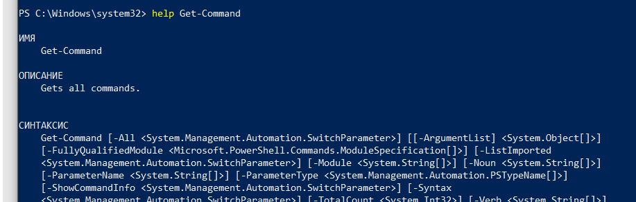    

2. Набрать и выполнить команду ```dir```  
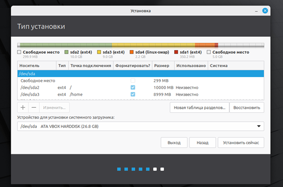    

3. Создать текстовый файл t1.bat со следующим содержанием:  
```Echo off     
Cls     
echo we are students of AIPET!      
echo:       
echo Hello!     
```     
Выполнить его, вызвав t1.bat. Объяснить появление фрагментов данных на экране   
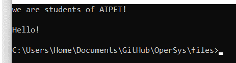    
📸 Объяснение результата:  
Мы вывели строки в командную строку с помощью echo  

4. Заменить команду echo off на echo on. Снова вызвать файл t1.bat. Объяснить появление фрагментов данных на экране    
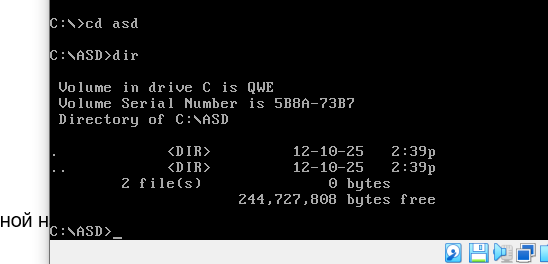    

📸 Объяснение результата:    
Разрешили выводить команды перед их выполнением.    

5. Создать командный файл t2.bat со следующим содержанием:  
```Echo off     
Rem it is first comment     
Cls     
Rem it is second comment        
echo good morning!      
Rem it is third comment     
echo:       
echo Hello!     
Rem it is last comment      
```     
Выполнить файл      
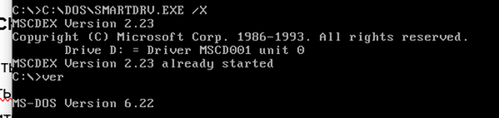    

6. Заменить echo off на echo on и снова выполнить файл  
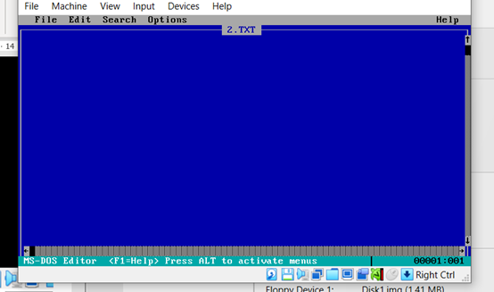    

7. Сравнить результаты и объяснить различия в выводимой информации на экране дисплея.   

📸 Объяснение результата:  
Разрешив выводить команды перед их выполнением, мы видим все комментарии.   

8. Создать командный файл ```f1.bat```, который выводит содержимое некоторого текстового файла. Создать командный файл ```f2.bat```, который вызывает командный файл ```f1.bat```. Используя echo, вывести файлы в разных режимах. Используя ```@```, сделать так, чтобы команды пакетного файла не выводились      
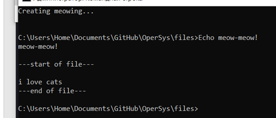    

9. Создать командный файл, который после вывода некоторых сообщений делал бы паузу, а затем бы выводил следующую фразу  
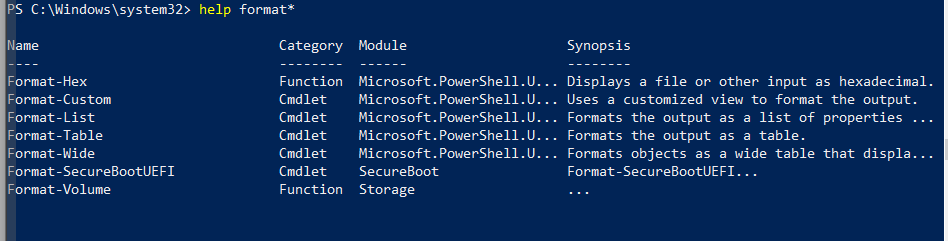   

10. Создать командный файл, который можно прервать, когда необходимо     
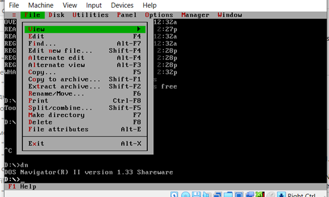   

11. Создать переменную окружения, которая находит остаток от деления двух целых чисел, найти целую часть от деления двух целых чисел     
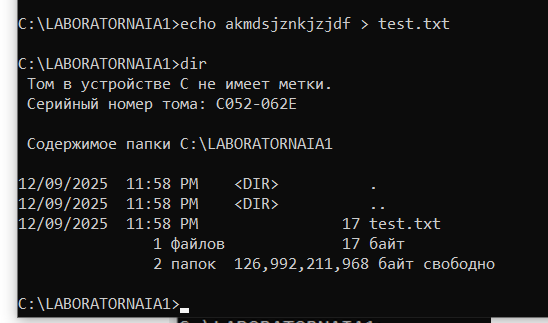   

12. Создать переменную окружения, которая имеет значение “aipet”     
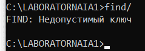   

13. Создать командный файл, который в случае совпадения двух строковых переменных присвоил бы целой переменной значение 2, в противном случае вывел бы строку – “no equal”       
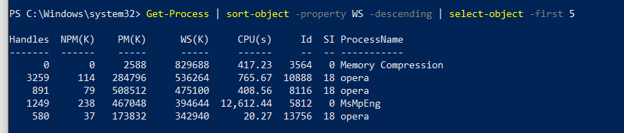   

14. Создать командный файл, который проверяет, есть ли в текущем каталоге заданный файл (использовать формальные параметры)      
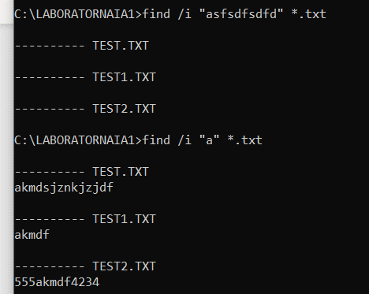   

12. Создать каталог. В созданном каталоге сформировать несколько текстовых файлов с разным содержанием. В режиме командной строки выполнить команду вывода на экран содержимого этих файлов. Создать командный файл для вывода файлов на экран       
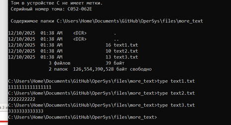   

## 🐱 Результат    
Были получены навыки создания пакетных файлов в режиме командной строки. Изучен состав внутренних команд и их функционал.