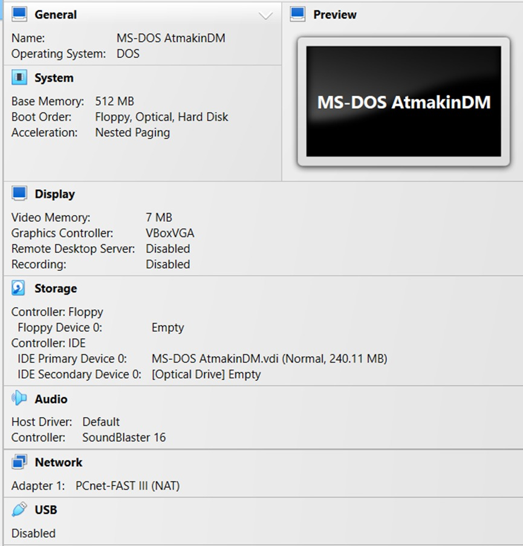
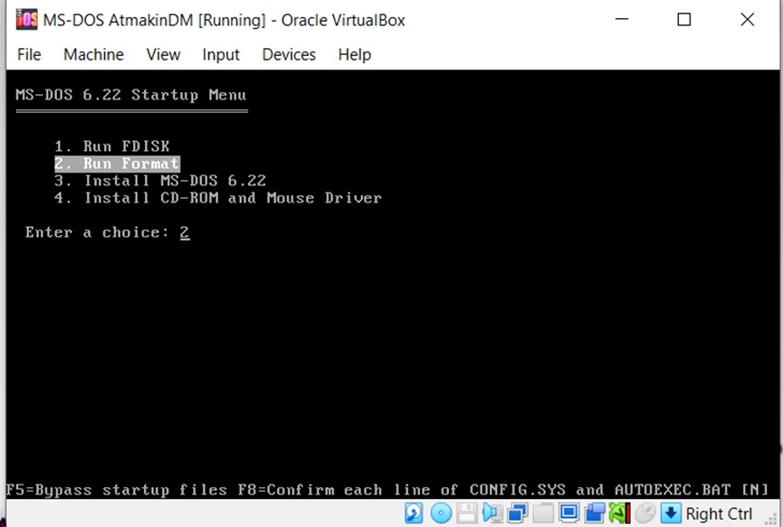
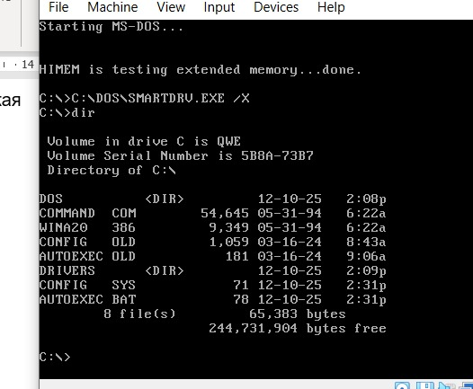

# Знакомство с виртуальной машиной Oracle Virtual Box. Установка и основы работы с операционной системой MS-DOS.  

## 📌 Цель работы 
Изучение основных понятий о виртуальных машинах для их практического применения. Приобретение основных навыков работы в среде операционной системы MS-DOS.    

## ✅ Задание и отчет выполнения
1. Создать виртуальную машину в программе VirtualBox (имя машины должно иметь следующий формат: MS-DOS Фамилия)              

2. Создать новый  виртуальный жесткий диск фиксированного размера не менее 10 Мб      

3. Войти в настройки созданной виртуальной машины, выбрать в качестве контроллера Flopy образ первой дискеты.   

4. Загляните в раздел Система и убедитесь, что на вкладке Материнская плата в порядке загрузки первой стоит дискета (если это не так вы с легкостью можете изменить порядок при помощи кнопок со стрелочками).    
    

5. Установка MS-DOS.            

6. Сделать скриншот виртуальной машины для отчета.       
    
    

7. Запустить виртуальную машину с установленной ОС MS-DOS. Очистить экран монитора. Запросить версию OS.
    

8. Создать новый каталог OS. Перейти в новый созданный каталог.     
    

9. Создать в нем (с помощью команды ```EDIT```) файл ```2.txt```.     
    

10. Файл 2.txt должен содержать все известные вам команды ms-dos (по одной на каждой строке). Сохранить созданный файл. Просмотреть созданный файл.      
   

11. Найти в сети Интернет и установить один из консольных файловых менеджеров - NortonCommander или DosNavigator        
   

12.	Перейти в корневой каталог.     

## 🐱 Результат    
Знакомство с oracle vm и ms-dos прошло успешно.
